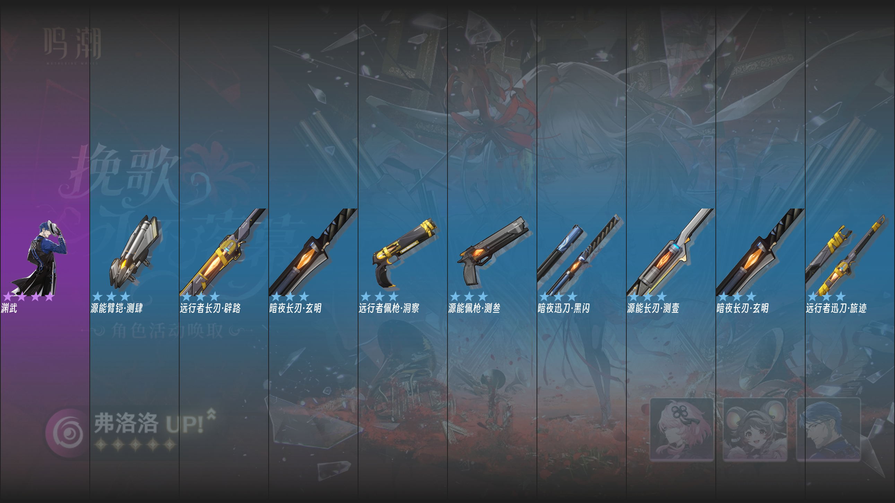

# 鸣潮抽卡模拟器

## 效果


## 干啥的

一个简单实现了鸣潮卡池模拟的Python库，包含1.0至今的所有角色/武器卡池。

## 用法

### 安装依赖

请确认您的电脑环境中包含以下库。

- pillow (PIL)

若未安装请使用 `pip` 进行安装。

```bash
pip install pillow
```

### 使用

将此库克隆到您的项目中并引用。

```bash
git clone https://github.com/Flowelife/WuwaDrawingSimulator.git
```

在您的代码中导入`CardDrawingSimulator`即可快速体验。

```python
from WuwaDrawingSimulator import Simulator

simulator = Simulator()
result = simulator.draw()

print(result)

'''OUTPUT
Reward(3-star: 9, 4-star: 1, 5-star: 0, rewards: [('远行者臂铠·破障', 3), ('源能音感仪·测五', 3), ('暗夜臂铠·夜芒', 3), ('源能长刃·测壹', 3), ('远行者迅刀·旅迹', 3), ('源能臂铠·测肆', 3), ('远行者长刃·辟路', 3), ('暗夜长刃·玄明', 3), ('远行者矩阵·探幽', 3), ('TAOQI', 4)], time: 2025-07-25 14:25:08, prize_pool: 挽歌永不落幕)
'''
```

同一`simulator`进行多次抽取会自动累计保底值。

```python
from WuwaDrawingSimulator import Simulator, Reward, SimulatorConfig

result = Reward([], SimulatorConfig.default_prize_pool)
simulator = Simulator()
for _ in range(16): # 一个大保底（160抽）
    print(f'5星保底{simulator.guaranteed_counts_5}/80 是否为大保底: {simulator.upper_promise_5}')
    result += simulator.draw()

print(result.count)

'''OUTPUT
5星保底0/80           是否为大保底: False
5星保底10/80           是否为大保底: False
5星保底20/80           是否为大保底: False
5星保底30/80           是否为大保底: False
5星保底40/80           是否为大保底: False
5星保底50/80           是否为大保底: False
5星保底60/80           是否为大保底: False
5星保底70/80           是否为大保底: False
5星保底0/80           是否为大保底: True
5星保底10/80           是否为大保底: True
5星保底20/80           是否为大保底: True
5星保底30/80           是否为大保底: True
5星保底40/80           是否为大保底: True
5星保底50/80           是否为大保底: True
5星保底60/80           是否为大保底: True
5星保底70/80           是否为大保底: True
{'3': 138, '4': 20, '5': 2}
'''
```

`Simulator`初始化参数如下:

| 参数名                      | 类型 | 用途                  | 取值                                              | 默认值             |
| --------------------------- | ---- | --------------------- | ------------------------------------------------- | ------------------ |
| prize_pool                  | dict | 需要模拟抽取的卡池    | str 卡池名称 | `SimulatorConfig.default_prize_pool`|
| inherit_guaranteed_counts_5 | int  | 已经多少抽没有出5星了 | int 范围[0,80]                                            | 0                  |
| inherit_guaranteed_counts_4 | int  | 已经多少抽没有出4星了 | int 范围[0,10]                                            | 0                  |
| upper_promise_5            | bool | 下一个5星是否必定为up | True or False                                     | False              |
|upper_promise_4            | bool | 下一个4星是否必定为up | True or False                                     | False              |

`draw()`返回一个`Reward`对象。

`Reward`中封装了抽取结果，分布统计。您可以使用成员`reward`、`count`来访问它们。

```python
from WuwaDrawingSimulator import Simulator, SimulatorConfig

simulator = Simulator()
result = simulator.draw(80)
print(f'rewords: {result.rewards}\n')
print(f'count: {result.count}')

"""OUTPUT
rewords: [('暗夜长刃·玄明', 3), ('远行者迅刀·旅迹', 3), ('源能臂铠·测肆', 3), ......, ('源能音感仪·测五', 3), ('TAOQI', 4), ('暗夜臂铠·夜芒', 3)]

count: {'3': 67, '4': 11, '5': 2}
"""
```

成员函数`to_image()`可以将结果转化为`Image`对象。不同的元素数量的`Reward`输出的效果也不相同。


```python
image = result.to_image()
image.show()
```

10个以内的元素:


10个以上的元素


您可以用这个简单的方式来存储结果。
```python
image.save(filename)
```

如果需要进行分割可以使用成员函数`split()`，其接受一个`int`类型的参数`x`来确定每组的元素个数，`x`默认为10，该函数将返回一个包含多个`Reward`的列表。
```python
from WuwaDrawingSimulator import Simulator, SimulatorConfig

simulator = Simulator()
result = simulator.draw(20)

print(result.split())
print(result.split(5))

"""OUTPUT
[Reward(3-star: 9, 4-star: 1, 5-star: 0, rewards: [...], time: 2025-07-25 14:16:17, prize_pool: 挽歌永不落幕), Reward(3-star: 7, 4-star: 3, 5-star: 0, rewards: [...], time: 2025-07-25 14:16:17, prize_pool: 挽歌永不落幕)]
[Reward(3-star: 5, 4-star: 0, 5-star: 0, rewards: [...], time: 2025-07-25 14:16:17, prize_pool: 挽歌永不落幕), Reward(3-star: 4, 4-star: 1, 5-star: 0, rewards: [...], time: 2025-07-25 14:16:17, prize_pool: 挽歌永不落幕), Reward(3-star: 4, 4-star: 1, 5-star: 0, rewards: [...], time: 2025-07-25 14:16:17, prize_pool: 挽歌永不落幕), Reward(3-star: 3, 4-star: 2, 5-star: 0, rewards: [...], time: 2025-07-25 14:16:17, prize_pool: 挽歌永不落幕)]
"""
```

成员函数`sort()`可以对`Reward`中的元素根据物品星级进行原地排序，默认从低到高，将参数`reverse`设置为`True`可以修改为从高到低。
```python
from WuwaDrawingSimulator import Simulator

simulator = Simulator()
result = simulator.draw()

print("org: ", result.rewards)

result.sort(True)
print("htl: ", result.rewards)

result.sort()
print("lth: ", result.rewards)

"""OUTPUT
org:  [('源能音感仪·测五', 3), ('远行者臂铠·破障', 3), ('远行者矩阵·探幽', 3), ('远行者迅刀·旅迹', 3), ('暗夜长刃·玄明', 3), ('远行者佩枪·洞察', 3), ('LUMI', 4), ('源能迅刀·测贰', 3), ('暗夜佩枪·暗星', 3), ('PHROLOVA', 5)]
htl:  [('PHROLOVA', 5), ('LUMI', 4), ('源能音感仪·测五', 3), ('远行者臂铠·破障', 3), ('远行者矩阵·探幽', 3), ('远行者迅刀·旅迹', 3), ('暗夜长刃·玄明', 3), ('远行者佩枪·洞察', 3), ('源能迅刀·测贰', 3), ('暗夜佩枪·暗星', 3)]
lth:  [('源能音感仪·测五', 3), ('远行者臂铠·破障', 3), ('远行者矩阵·探幽', 3), ('远行者迅刀·旅迹', 3), ('暗夜长刃·玄明', 3), ('远行者佩枪·洞察', 3), ('源能迅刀·测贰', 3), ('暗夜佩枪·暗星', 3), ('LUMI', 4), ('PHROLOVA', 5)]
"""
```

`PrizePool`类用于查询、创建卡池、角色名字转换。

```python
from WuwaDrawingSimulator import PrizePool

pool = PrizePool.get_prize_pool_list()                  # 获取所有卡池名称
pool_by_ver = PrizePool.get_version_prize_pool('2.4')   # 查询游戏某一版本的卡池
info = PrizePool.get_prize_pool_info(pool[0])           # 通过卡池名称查看卡池up信息
prize_pool = PrizePool.prize_pool_generate(pool[0])     # 通过卡池名生成卡池具体内容
name = PrizePool.get_character_name(info['5'])          # 将角色名称转成中文名

print('pool:',pool)
print('\npool_by_ver:', pool_by_ver)
print('\ninfo:', info)
print('\nprize_pool:', prize_pool)
print('\nname:', name)

'''OUTPUT
pool: ['胜利为我喝彩', '焰痕', '却也在风潮后轻舞', '不屈命定之冠', '行于光影之间', '诗与乐的交响', '焰光裁定', '林间的咏叹
调', '海的呢喃', '星序协响', '裁春', '直至海水褪色', '徘徊迷宫尽处', '映海之梦', '于静谧呢喃', '燃焰于海', '炽羽策阵星', ' 和光回唱', '不灭航路', '赫奕流明', '另一种喧嚣', '附彩作长吟', '箱中舞台', '寒尽觉春生', '死与舞', '琼枝冰绡', '悲喜剧', ' 时和岁稔', '惊庭雨时节', '千机逐星野', '掣傀之手', '诸方玄枢', '夜将寒色去', '苍鳞千嶂']

pool_by_ver: ['胜利为我喝彩', '焰痕', '却也在风潮后轻舞', '不屈命定之冠']

info: {'type': 'character', '4': ['SANHUA', 'BAIZHI', 'CHIXIA'], '5': 'LUPA'}

prize_pool: {'type': 'character', '3': ['源能长刃·测壹', '源能迅刀·测贰', '源能佩枪·测叁', '源能臂铠·测肆', '源能音感仪·测 五', '远行者长刃·辟路', '远行者迅刀·旅迹', '远行者佩枪·洞察', '远行者臂铠·破障', '远行者矩阵·探幽', '暗夜长刃·玄明', '暗夜 迅刀·黑闪', '暗夜佩枪·暗星', '暗夜臂铠·夜芒', '暗夜矩阵·暝光'], '4': {'up': ['SANHUA', 'BAIZHI', 'CHIXIA'], 'normal': ['不 归孤军', '东落', '今州守望', '凋亡频移', '华彩乐段', '呼啸重音', '奇幻变奏', '尘云旋臂', '异响空灵', '异度', '悖论喷流', ' 无眠烈火', '核熔星盘', '永夜长明', '永续坍缩', '行进序曲', '袍泽之固', '西升', '飞逝', '骇行', 'YANGYANG', 'YOUHU', 'LUMI', 'TAOQI', 'YUANWU', 'MORTEFI', 'AALTO', 'DANJIN']}, '5': {'up': 'LUPA', 'normal': ['CALCHARO', 'JIANXIN', 'VERINA', 'LINGYANG', 'ENCORE']}}

name: 露帕
'''
```

`SimulatorConfig`用于设置模拟器的各项数值，修改后对下一个`Simulator`实例化生效。
```python
from WuwaDrawingSimulator import Simulator, SimulatorConfig

simulator_1 = Simulator()   # simulator_1 使用原参数

SimulatorConfig.maximum_draw_5 = 10
SimulatorConfig.maximum_draw_4 = 7

simulator_2 = Simulator()   # simulator_2 使用修改后的参数 
```
可修改的参数：
|属性|值类型|用途|默认值|
|---|---|---|---|
|default_prize_pool |  str  | 默认卡池 | '挽歌永不落幕' |
|maximum_draw_5 | int  |5星保底次数 | 80 |
|maximum_draw_4 | int                    |4星保底次数 | 10|
|basic_probability_5 |  float |5星基础概率 | 0.8 / 100 |
|basic_probability_4 |  float         |4星基础概率 |6 / 100|
|charactor_upper_probability | bool    |5星角色是否是不歪池 |False|
|arms_upper_probability |    bool      |5星武器是否是不歪池 |True |
|image_font_path | str | 字体文件位置 | os.path.join(os.path.dirname(\_\_file\_\_), 'resources', 'fonts', 'SmileySans-Oblique.ttf') |
|image_star_font_size | int   | 星级字体大小 | 40 |
|image_name_font_size | int   | 名称字体大小 | 30 |
|image_background | tuple\[int,int,int,int\]  | 图片大背景 | (31,31,31,255) |